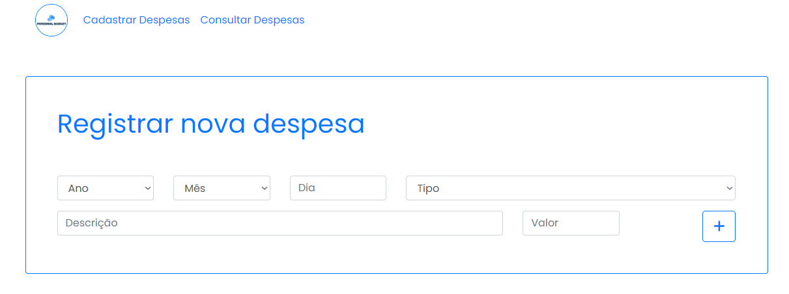
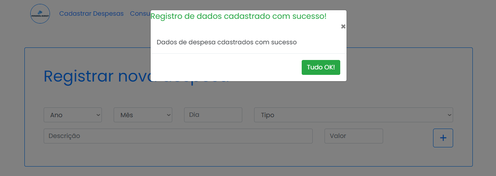
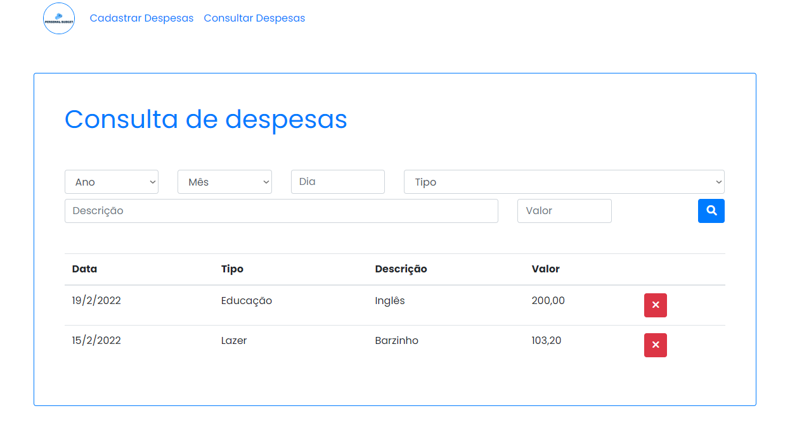

# Personal Budget App

Repositório dedicado ao projeto final da seção de Javascript do desenvolvimento Web Completo - UDEMY

# Titulo

# Sobre o projeto

Projeto composto de duas páginas uma para cadastro de despesas e outra para checagem, filtragem e remoção.

Os dados foram armazenados em Local Storage no Browser.

Utilizando todos os recursos ensinados durante o módulo , explorando Programação Orientada a Objetos, classes, métodos.

# Layout web

## Página de Registro de Despesa

## Página de Sucesso de Cadastro

## Página de Consulta de Cadastro

# Tecnologias utilizadas

## Back end

Dados armazenados em Local Storage

## Front end

HTML5

CSS3

Javascript/ POO

Bootstrap 4

# Autor

Priscilla Falcão
